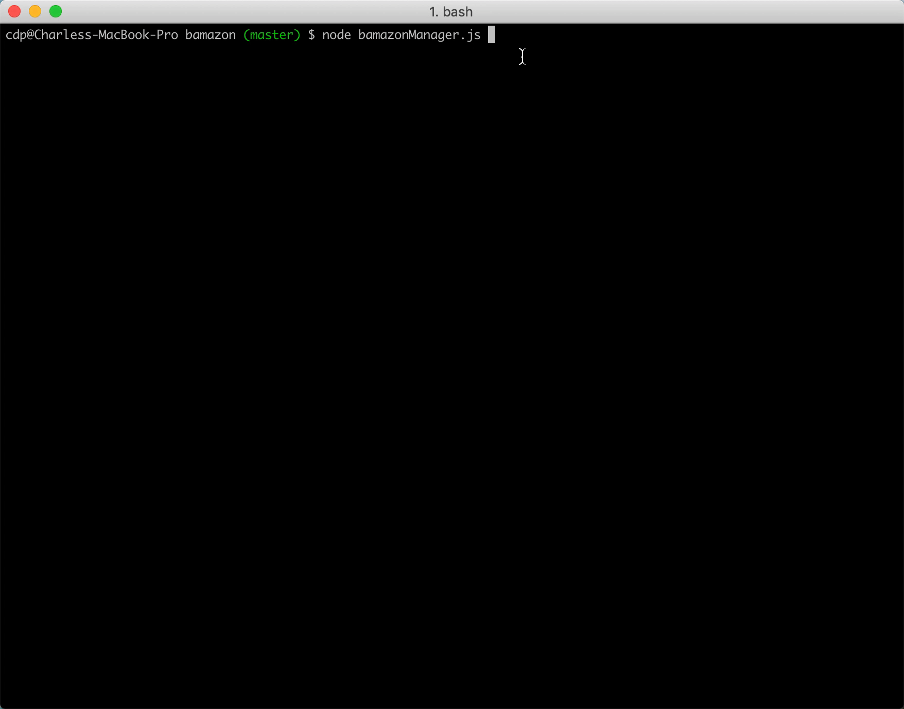
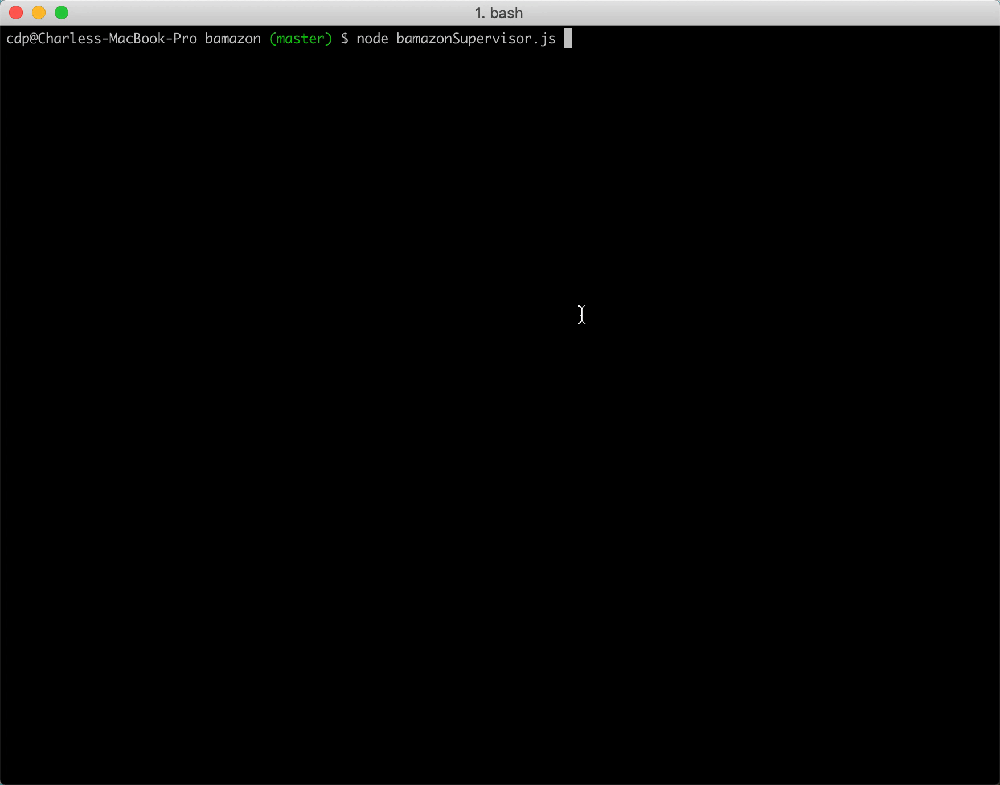

This app functions similarly to an online storefront, think Amazon but on a miniature scale.  The app has three separate functions, a customer facing interface, and an inward facing interface for a hypothetical manager or employee, and a supervisor interface that allows someone to view sales numbers by department.  The customer can choose items by unique ID, and purchase any number of them, so long as they are in stock.  The app will total up their cost, and track the inventory with each sale.  The manager app allows someone to search all products for those which have a low inventory (under 5 units), restock an item (setting the stock quantity to 50), or add new products for sale.  In addition to viewing sales numbers by department, the supervisor can add new departments as well.

The app utilizes two different NPM packages, mysql and inquirer, to both store data and to take in user prompts specifying what action to take.

Customer Interface:

On start up, the app will display a table with all available products, the price per product, and the available quantity.  Using the displayed ID, the user can select which ever product they would like, or they can type 'exit' to break out of the program.  The gif below shows the basic functionality.

Manager Interface:

On start up, the user will be issued a prompt asking which action they'd like to perform. They can view a table that displays all available products, their price, their quantity, and the total sales for that particular product.  They can also view items with low inventory (under 5).  Users also have the ability to "restock" products, which will increase the stock quantity of any item with low inventory by 50, or add an entirely new product.  The gif below demonstrates all functions.

Supervisor Interface:

On start up, the user will be issued a prompt asking which action they'd like to take.  They can view sales by department, which will subtract the product sales totals from the department overhead costs and display the profit in an easy to read table.  They also have the option to add a new department. 

